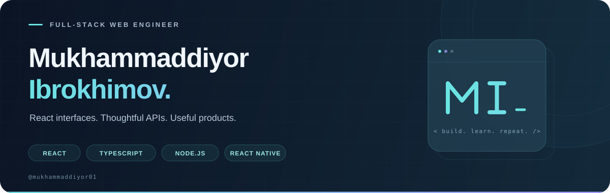

  

  <a href="https://www.telegram.me/IMR0208"><strong>Telegram</strong></a>
  &nbsp; / &nbsp;
  <a href="https://www.instagram.com/muhammaddiyor_shavkatbek"><strong>Instagram</strong></a>
  &nbsp; / &nbsp;
  <a href="https://github.com/mukhammaddiyor01?tab=repositories"><strong>Explore my repositories ↗</strong></a>

 

## A little about me

I'm **Mukhammaddiyor**, a software and media engineer building full-stack web applications with **React, TypeScript, Node.js, and MongoDB**. I enjoy connecting clear, responsive interfaces with the APIs and data behind them.

- **Building:** shopping experiences, seller dashboards, and REST APIs.
- **Growing:** my backend skills with NestJS and TypeScript.
- **Exploring:** Python and AI-agentic web development.

## Selected work

<table>
  <tr>
    <td width="50%" valign="top">
      01 / COMMERCE · FRONTEND
      <h3><a href="https://github.com/mukhammaddiyor01/MNShop-react">MNShop — Web App ↗</a></h3>
      
A shopping interface and seller workspace with product discovery, checkout screens, order management, and account settings.

      
<code>React</code> <code>TypeScript</code> <code>Redux Toolkit</code>

    </td>
    <td width="50%" valign="top">
      02 / COMMERCE · BACKEND
      <h3><a href="https://github.com/mukhammaddiyor01/mnshop">MNShop — API ↗</a></h3>
      
The backend for MNShop, with authentication, product and order services, seller management, and an admin dashboard.

      
<code>Express</code> <code>TypeScript</code> <code>MongoDB</code>

    </td>
  </tr>
  <tr>
    <td width="50%" valign="top">
      03 / RESTAURANT · FULL STACK
      <h3><a href="https://github.com/mukhammaddiyor01/burak">Burak ↗</a></h3>
      
A restaurant application with member accounts, product management, and order services, alongside a React frontend.

      
<code>React</code> <code>Express</code> <code>MongoDB</code>

      
<a href="https://github.com/mukhammaddiyor01/burak">Backend</a> · <a href="https://github.com/mukhammaddiyor01/burak-react">Frontend</a>

    </td>
    <td width="50%" valign="top">
      04 / BACKEND · LEARNING
      <h3><a href="https://github.com/mukhammaddiyor01/nestar">NestJS Lab ↗</a></h3>
      
My space for learning NestJS: working with application structure, controllers, services, and REST API fundamentals.

      
<code>NestJS</code> <code>TypeScript</code> <code>Node.js</code>

      
<a href="https://github.com/mukhammaddiyor01/nestar">Nestar</a> · <a href="https://github.com/mukhammaddiyor01/zoo">Zoo API</a>

    </td>
  </tr>
</table>

## My toolkit

| Area | Technologies |
| :--- | :--- |
| **Frontend** | React · Redux Toolkit · TypeScript · JavaScript · HTML · CSS |
| **Backend** | Node.js · Express · NestJS · REST APIs |
| **Data & workflow** | MongoDB · Mongoose · Git · GitHub |
| **Exploring** | Python · AI-agentic web development |

## One contribution at a time

<picture>
  <source media="(prefers-color-scheme: dark)" srcset="https://raw.githubusercontent.com/mukhammaddiyor01/mukhammaddiyor01/output/github-contribution-grid-snake-dark.svg" />
  <source media="(prefers-color-scheme: light)" srcset="https://raw.githubusercontent.com/mukhammaddiyor01/mukhammaddiyor01/output/github-contribution-grid-snake.svg" />
  
</picture>

 

  <strong>Have an idea? Let's talk.</strong> 
  <a href="https://www.telegram.me/IMR0208">Find me on Telegram ↗</a>

